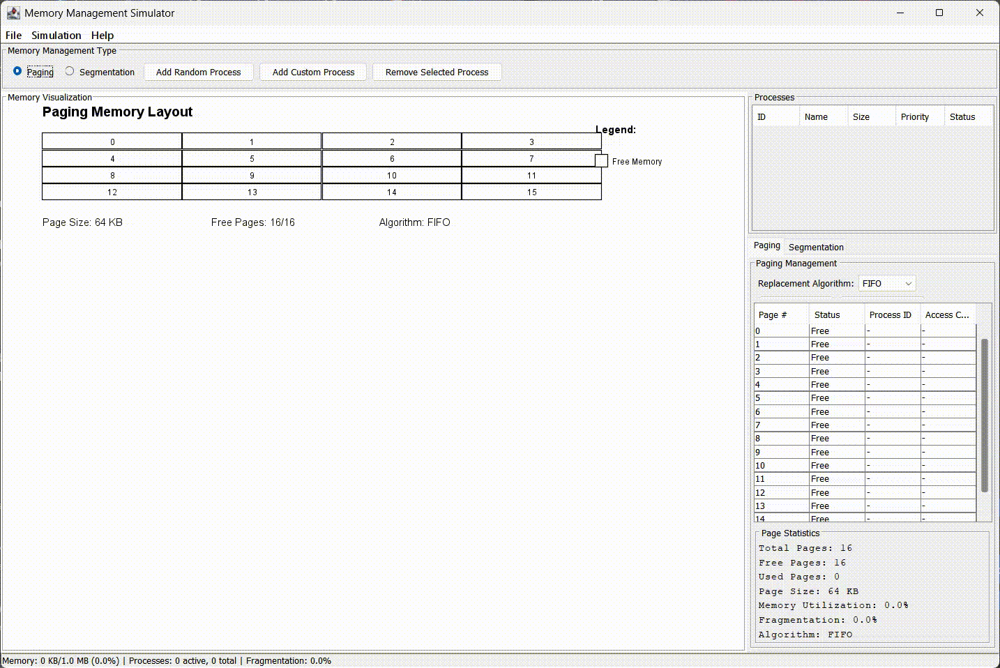

# Memory Management Simulator

A comprehensive Java GUI application that simulates memory management techniques used in operating systems, specifically **Paging** and **Segmentation**.

## Demo

Watch a quick demonstration of the Memory Management Simulator in action:
[▶️ Watch Demo Video (MP4)](https://github.com/OG-CZ/memory-management-simulator/raw/main/demo.mp4)


<!-- ## Features

### Core Functionality

- **Dual Memory Management**: Switch between Paging and Segmentation modes
- **Real-time Visualization**: Visual representation of memory allocation and fragmentation
- **Process Management**: Create, allocate, and deallocate processes dynamically
- **Statistics Dashboard**: Live memory utilization and fragmentation metrics

### Paging Mode

- **Page Replacement Algorithms**: FIFO, LRU, and Optimal algorithms
- **Page Table Visualization**: View page allocation status and ownership
- **Page Access Simulation**: Simulate page access patterns
- **Memory Fragmentation Analysis**: Track internal fragmentation

### Segmentation Mode

- **Dynamic Allocation**: Variable-sized segment allocation (Code, Data, Stack)
- **Memory Compaction**: Reduce external fragmentation
- **Segment Table**: Detailed segment information with addresses and sizes
- **Best-fit Algorithm**: Efficient memory allocation strategy

### User Interface

- **Interactive GUI**: Modern Swing-based interface with tabbed panels
- **Process Table**: List of all processes with their properties
- **Control Panels**: Easy-to-use buttons for process and memory management
- **Real-time Updates**: Live statistics and memory state updates
- **Menu System**: File operations, simulation controls, and help -->

## How to Use

### Getting Started

1. **Compile**: `javac -cp "src\main\java" -d build src\main\java\Main.java src\main\java\gui\*.java src\main\java\memory\*.java src\main\java\utils\*.java`
2. **Run**: `java -cp build Main`

### Using the Application

#### Memory Management Selection

- Choose between **Paging** or **Segmentation** using radio buttons at the top
- The visualization and statistics will update automatically

#### Process Management

- **Add Random Process**: Creates a process with random size and name
- **Add Custom Process**: Define your own process parameters
- **Remove Process**: Select and delete a process from the table

#### Memory Visualization

- **Main Panel**: Visual representation of memory layout
- **Color Coding**: Different colors for free memory, processes, and segment types
- **Legend**: Understanding the color scheme and symbols

#### Advanced Features

- **Stress Test**: Create multiple processes to test memory limits
- **Memory Compaction**: Reorganize segments to reduce fragmentation
- **Algorithm Selection**: Change page replacement algorithms in paging mode

<!-- ## Project Structure

```
src/main/java/
├── Main.java                          # Application entry point
├── gui/
│   ├── MainFrame.java                 # Main application window
│   ├── MemoryVisualizationPanel.java  # Memory visualization component
│   ├── PagingPanel.java              # Paging-specific controls
│   └── SegmentationPanel.java        # Segmentation-specific controls
├── memory/
│   ├── MemoryManager.java             # Core memory management coordinator
│   ├── PagingManager.java             # Paging implementation
│   ├── SegmentationManager.java      # Segmentation implementation
│   └── Process.java                   # Process data structure
└── utils/
    ├── Constants.java                 # Application constants
    └── MemoryUtils.java               # Utility functions
```

## Educational Value

This simulator helps understand:

- **Memory allocation strategies** and their trade-offs
- **Fragmentation** causes and solutions
- **Page replacement algorithms** and their performance
- **Address translation** mechanisms
- **Memory compaction** benefits and costs -->
